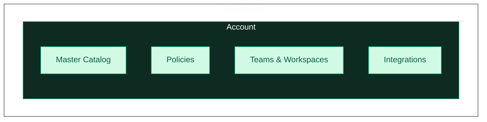

Accounts are Tero's hard boundary. Everything inside an account is separate from other accounts: catalog, policies, integrations, teams. Data never crosses account boundaries.

Most organizations use a single account. Multi-account is for organizations that need complete separation between environments.

## Structure

An organization contains one or more accounts. Each account contains its own:

- **Master Catalog** — Services, log events, metrics, traces
- **Policies** — Data quality rules and enforcement
- **Teams** — Users and service ownership
- **Workspaces** — Different policy sets for the same data
- **Integrations** — Datadog, Splunk, GitHub, etc.

## When to use multiple accounts

- **Compliance boundaries** — FedRAMP, HIPAA, PCI environments that must be isolated
- **Regional separation** — EU and US data that cannot be mixed
- **Organizational boundaries** — Acquisitions or business units that operate independently

If you need different teams to manage the same data differently, use [workspaces](/account-management/workspaces) instead. Workspaces share a catalog; accounts don't.

## User access

Users can belong to multiple accounts. Admins grant access per-account. The organization lets users switch between accounts they have access to.

## Creating accounts

Contact us to set up additional accounts.
