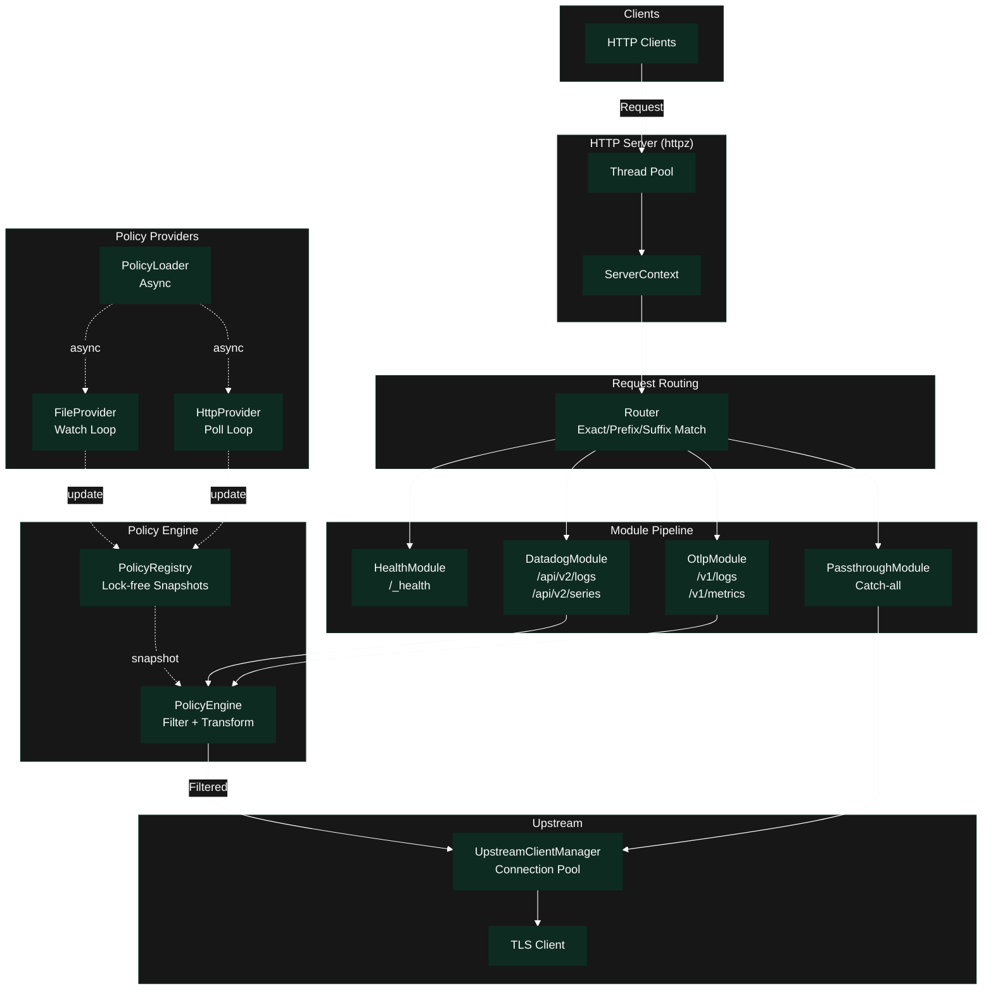
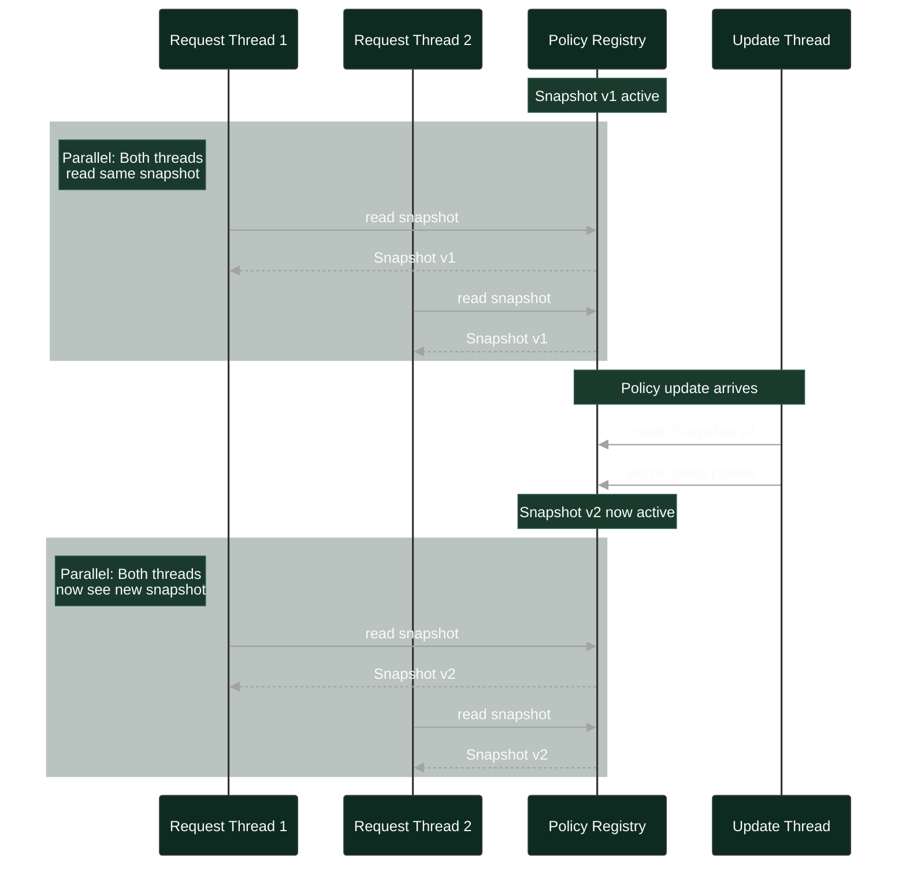
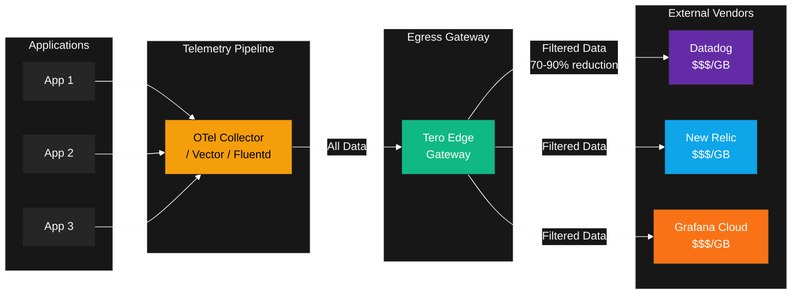
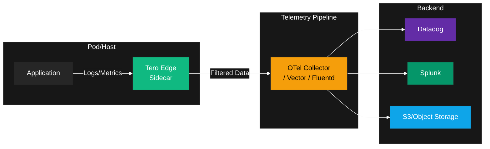

Edge is a lightweight proxy built in Zig, designed for high throughput and low
latency telemetry processing via Policies.

## Component Overview

### Internal Architecture

### Protocol Modules

Each distribution includes modules for specific protocols:

| Module          | Endpoints        | Description                  |
| --------------- | ---------------- | ---------------------------- |
| Datadog Logs    | `/api/v2/logs`   | Datadog log ingestion API    |
| Datadog Metrics | `/api/v1/series` | Datadog metrics API          |
| OTLP Logs       | `/v1/logs`       | OpenTelemetry log export     |
| OTLP Metrics    | `/v1/metrics`    | OpenTelemetry metrics export |

Modules are stateless. They parse incoming requests, evaluate policies, and
forward results. All state lives in the policy registry.

### Policy Registry

The registry holds all loaded policies and provides lock-free read access during
request processing.

Key properties:

- **Atomic snapshots**: Writers create new snapshots; readers use existing ones
- **Lock-free reads**: No contention during policy evaluation
- **Hot reload**: New policies take effect without restart

This design means policy updates never block request processing.

### Policy Engine

The engine evaluates policies against telemetry using Vectorscan (a Hyperscan
fork) for regex matching.

Evaluation flow:

1. **Index lookup**: Find policies that might match based on field keys
2. **Regex scan**: Evaluate regex patterns against field values
3. **Action merge**: Combine keep/transform actions from matching policies
4. **Apply**: Execute the merged actions

Vectorscan compiles regex patterns into finite automata, enabling simultaneous
evaluation of thousands of patterns in a single pass.

### Policy Providers

Providers load policies from external sources:

| Provider | Source           | Reload Mechanism                   |
| -------- | ---------------- | ---------------------------------- |
| File     | Local filesystem | inotify/kqueue file watching       |
| HTTP     | Remote endpoint  | Polling with configurable interval |

Multiple sources can be configured. Policies from all sources merge together.
The policy ID acts as a unique key. If two providers emit a policy with the same
ID, the one from the higher-priority source (HTTP > file) wins. Same-priority
sources will have the later update win. This structure allows you to create a
set of default policies that can be overridden remotely.

## Design Principles

### Data-Oriented Design

Edge optimizes for memory access patterns and cache coherency. Data structures
are laid out for sequential access, minimizing cache misses during
high-throughput processing.

### Lock-Free Reads

Policy evaluation is a read-heavy operation—every request needs to read
policies, but updates are rare. Edge uses atomic pointers to policy snapshots,
eliminating read-side synchronization.

### Fail-Open

Edge prioritizes availability. If policy evaluation fails for any reason,
telemetry passes through unchanged. You might miss a filter, but you won't lose
data.

### Stateless Modules

Protocol modules don't maintain state. All they do is:

1. Parse the request
2. Read policies from the registry
3. Apply policies to the data
4. Forward to upstream

This makes modules easy to reason about and safe to run in parallel.

## Performance Characteristics

| Metric              | Typical Value     |
| ------------------- | ----------------- |
| Latency overhead    | < 5ms p99         |
| Requests per second | 90k+              |
| Policy evaluation   | O(1) average case |
| Memory per policy   | ~1KB              |
| Max policies tested | 8,000+            |

Performance depends on:

- Number of regex patterns (more patterns = more evaluation time)
- Request body size (larger bodies take longer to parse)

## Deployment Patterns

### Gateway

Deploy Edge as a shared gateway for multiple services:

**Use Case**: Tero Edge sits at the egress point after your telemetry pipeline.
It acts as a final gateway before data leaves your network, applying
cost-focused policies to dramatically reduce egress to expensive SaaS vendors.
Drop redundant health checks, sample high-cardinality metrics, and keep only
actionable data—cutting observability costs by up to 90%.

Best for:

- Centralized policy management
- Environments with many services
- When you want a single point of control

### Sidecar

Deploy Edge alongside each service:

**Use Case**: Tero Edge runs as a lightweight sidecar next to each application.
It applies policies at the source—dropping noisy debug logs, redacting PII, or
sampling high-volume metrics—before data ever reaches the telemetry pipeline.
This reduces load on collectors and network bandwidth within your
infrastructure.

Best for:

- Service-specific policies
- Isolation between services
- Kubernetes environments with sidecar injection

## Next Steps

<CardGroup cols={2}>
  <Card title="Quickstart" icon="rocket" href="/edge/quickstart">
    Get Edge running in 5 minutes
  </Card>
  <Card title="Reference" icon="gear" href="/edge/reference">
    Full configuration reference
  </Card>
</CardGroup>
