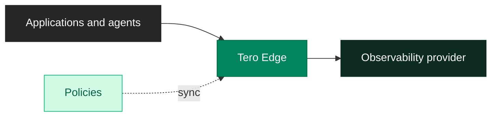

[Edge](https://github.com/usetero/edge) is a telemetry policy runtime. It runs in your infrastructure and applies policies to telemetry before that data reaches an observability provider.

Edge sits between telemetry sources and destinations:

Use Edge when a policy should run before telemetry leaves your network. Common policy actions include dropping low-value logs, sampling high-volume events, redacting sensitive values, and transforming fields into a cleaner shape.

## Where Edge fits

Tero owns policy review, state, and impact. Edge owns runtime execution for the policies deployed to it.

That separation matters. Reviewers can inspect issue evidence and approve policy changes in Tero. Edge receives the policy set, evaluates incoming telemetry, and forwards the telemetry that remains after policy execution.

**Edge does not replace your observability provider**. It changes what reaches the provider.

## When to use Edge

Edge is useful when the control should happen close to the telemetry source:

- Sensitive data should be redacted before it leaves your infrastructure.
- Repetitive logs should be dropped before they consume provider ingestion.
- High-volume events should be sampled or rate-limited before they flood the pipeline.
- Field transforms should run consistently across services before storage.

Provider-side controls can still be useful. Edge is the runtime surface for policies that need to execute in your environment instead of only inside Datadog, Splunk, or another destination.

## What Edge processes

Edge receives telemetry through supported distributions and protocols, evaluates policies, and forwards surviving telemetry upstream.

Current distribution docs cover:

<CardGroup cols={3}>
  <Card title="Datadog" icon="dog" href="/edge/distributions/datadog">
    Datadog log and metric ingestion.
  </Card>
  <Card title="OTLP" icon="diagram-project" href="/edge/distributions/otlp">
    OpenTelemetry Protocol ingestion.
  </Card>
  <Card title="All protocols" icon="cubes" href="/edge/distributions/all">
    Multi-protocol Edge distribution.
  </Card>
</CardGroup>

## Where to go next

Use [How Edge works](/edge/concepts) for the runtime model. Use [Quickstart](/edge/quickstart) to run Edge locally and verify one policy.
