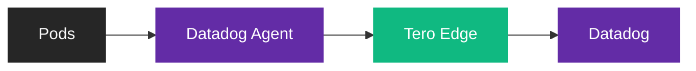

<Frame>
  
</Frame>

Deploy Tero Edge alongside your Datadog Agent to apply policies to logs,
metrics, and traces before they leave your cluster.

## How it works

Edge runs as a DaemonSet on each node. The Datadog Agent sends logs through Edge
instead of directly to Datadog. Edge applies policies and forwards to Datadog.



Edge only proxies telemetry (logs, metrics, traces). Other agent traffic
(security monitoring, remote config, fleet management) goes directly to Datadog.

## Prerequisites

- Datadog Agent running on Kubernetes (via
  [Helm](https://docs.datadoghq.com/containers/kubernetes/installation/?tab=helm)
  or
  [Datadog Operator](https://docs.datadoghq.com/containers/kubernetes/installation/?tab=operator))
- `kubectl` access to your cluster
- Tero account

## Connect

<Steps>
  <Step title="Create an Edge API key">
    Open your terminal and run:

    ```bash
    tero
    ```

    Navigate to **Edge** → **API Keys** → **Create**. Name your key (e.g., "Production cluster"). Copy the key when shown—it's only displayed once.

  </Step>

  <Step title="Create the namespace and secret">
    Create the namespace and store your API key as a Kubernetes secret:

    ```bash
    kubectl create namespace tero-system

    kubectl create secret generic tero-edge \
      --namespace tero-system \
      --from-literal=api-key=YOUR_API_KEY
    ```

  </Step>

  <Step title="Create the Edge ConfigMap">
    Create a ConfigMap with your Edge configuration. Select your Datadog region:

    <Tabs>
      <Tab title="US1">
        ```yaml tero-edge-config.yaml
        apiVersion: v1
        kind: ConfigMap
        metadata:
          name: tero-edge-config
          namespace: tero-system
        data:
          config.json: |
            {
              "listen_address": "0.0.0.0",
              "listen_port": 8080,
              "upstream_url": "https://agent-http-intake.logs.datadoghq.com",
              "metrics_url": "https://api.datadoghq.com",
              "workspace_id": "90A6EFC2-27B8-41BC-9343-43BFB1DF0732",
              "log_level": "info",
              "max_body_size": 1048576,
              "policy_providers": [
                {
                  "id": "tero",
                  "type": "http",
                  "url": "https://sync.usetero.com/v1/policy/sync",
                  "headers": [
                    { "name": "Authorization", "value": "Bearer ${TERO_API_KEY}" }
                  ]
                }
              ]
            }
        ```
      </Tab>
      <Tab title="US3">
        ```yaml tero-edge-config.yaml
        apiVersion: v1
        kind: ConfigMap
        metadata:
          name: tero-edge-config
          namespace: tero-system
        data:
          config.json: |
            {
              "listen_address": "0.0.0.0",
              "listen_port": 8080,
              "upstream_url": "https://agent-http-intake.logs.us3.datadoghq.com",
              "metrics_url": "https://api.us3.datadoghq.com",
              "workspace_id": "90A6EFC2-27B8-41BC-9343-43BFB1DF0732",
              "log_level": "info",
              "max_body_size": 1048576,
              "policy_providers": [
                {
                  "id": "tero",
                  "type": "http",
                  "url": "https://sync.usetero.com/v1/policy/sync",
                  "headers": [
                    { "name": "Authorization", "value": "Bearer ${TERO_API_KEY}" }
                  ]
                }
              ]
            }
        ```
      </Tab>
      <Tab title="US5">
        ```yaml tero-edge-config.yaml
        apiVersion: v1
        kind: ConfigMap
        metadata:
          name: tero-edge-config
          namespace: tero-system
        data:
          config.json: |
            {
              "listen_address": "0.0.0.0",
              "listen_port": 8080,
              "upstream_url": "https://agent-http-intake.logs.us5.datadoghq.com",
              "metrics_url": "https://api.us5.datadoghq.com",
              "workspace_id": "90A6EFC2-27B8-41BC-9343-43BFB1DF0732",
              "log_level": "info",
              "max_body_size": 1048576,
              "policy_providers": [
                {
                  "id": "tero",
                  "type": "http",
                  "url": "https://sync.usetero.com/v1/policy/sync",
                  "headers": [
                    { "name": "Authorization", "value": "Bearer ${TERO_API_KEY}" }
                  ]
                }
              ]
            }
        ```
      </Tab>
      <Tab title="EU">
        ```yaml tero-edge-config.yaml
        apiVersion: v1
        kind: ConfigMap
        metadata:
          name: tero-edge-config
          namespace: tero-system
        data:
          config.json: |
            {
              "listen_address": "0.0.0.0",
              "listen_port": 8080,
              "upstream_url": "https://agent-http-intake.logs.datadoghq.eu",
              "metrics_url": "https://api.datadoghq.eu",
              "workspace_id": "90A6EFC2-27B8-41BC-9343-43BFB1DF0732",
              "log_level": "info",
              "max_body_size": 1048576,
              "policy_providers": [
                {
                  "id": "tero",
                  "type": "http",
                  "url": "https://sync.usetero.com/v1/policy/sync",
                  "headers": [
                    { "name": "Authorization", "value": "Bearer ${TERO_API_KEY}" }
                  ]
                }
              ]
            }
        ```
      </Tab>
      <Tab title="AP1">
        ```yaml tero-edge-config.yaml
        apiVersion: v1
        kind: ConfigMap
        metadata:
          name: tero-edge-config
          namespace: tero-system
        data:
          config.json: |
            {
              "listen_address": "0.0.0.0",
              "listen_port": 8080,
              "upstream_url": "https://agent-http-intake.logs.ap1.datadoghq.com",
              "metrics_url": "https://api.ap1.datadoghq.com",
              "workspace_id": "90A6EFC2-27B8-41BC-9343-43BFB1DF0732",
              "log_level": "info",
              "max_body_size": 1048576,
              "policy_providers": [
                {
                  "id": "tero",
                  "type": "http",
                  "url": "https://sync.usetero.com/v1/policy/sync",
                  "headers": [
                    { "name": "Authorization", "value": "Bearer ${TERO_API_KEY}" }
                  ]
                }
              ]
            }
        ```
      </Tab>
    </Tabs>

    <Accordion title="Using a file provider instead?">
      If you prefer to manage policies locally instead of syncing from Tero, use a file provider. Add `policies.json` to your ConfigMap:

      ```yaml tero-edge-config.yaml
      apiVersion: v1
      kind: ConfigMap
      metadata:
        name: tero-edge-config
        namespace: tero-system
      data:
        config.json: |
          {
            "listen_address": "0.0.0.0",
            "listen_port": 8080,
            "upstream_url": "https://agent-http-intake.logs.datadoghq.com",
            "metrics_url": "https://api.datadoghq.com",
            "workspace_id": "90A6EFC2-27B8-41BC-9343-43BFB1DF0732",
            "log_level": "info",
            "max_body_size": 1048576,
            "policy_providers": [
              {
                "id": "file",
                "type": "file",
                "path": "/etc/tero/policies.json"
              }
            ]
          }
        policies.json: |
          {
            "policies": [
              {
                "id": "drop-debug-logs",
                "name": "drop-debug-logs",
                "enabled": true,
                "log": {
                  "match": [{ "log_field": "severity_text", "regex": "DEBUG" }],
                  "keep": "none"
                }
              }
            ]
          }
      ```

      Update `upstream_url` and `metrics_url` for your Datadog region.
    </Accordion>

    ```bash
    kubectl apply -f tero-edge-config.yaml
    ```

  </Step>

  <Step title="Deploy the Edge DaemonSet">
    Deploy Edge to run on each node:

    ```yaml tero-edge-daemonset.yaml
    apiVersion: apps/v1
    kind: DaemonSet
    metadata:
      name: tero-edge
      namespace: tero-system
      labels:
        app: tero-edge
    spec:
      selector:
        matchLabels:
          app: tero-edge
      template:
        metadata:
          labels:
            app: tero-edge
        spec:
          containers:
            - name: tero-edge
              image: ghcr.io/usetero/edge:latest
              args:
                - /etc/tero/config.json
              env:
                - name: TERO_API_KEY
                  valueFrom:
                    secretKeyRef:
                      name: tero-edge
                      key: api-key
              ports:
                - containerPort: 8080
                  hostPort: 8080
                  protocol: TCP
              resources:
                requests:
                  cpu: 50m
                  memory: 32Mi
                limits:
                  cpu: 200m
                  memory: 64Mi
              volumeMounts:
                - name: tero-edge-config
                  mountPath: /etc/tero
                  readOnly: true
              livenessProbe:
                httpGet:
                  path: /_health
                  port: 8080
                initialDelaySeconds: 5
                periodSeconds: 10
              readinessProbe:
                httpGet:
                  path: /_health
                  port: 8080
                initialDelaySeconds: 2
                periodSeconds: 5
          volumes:
            - name: tero-edge-config
              configMap:
                name: tero-edge-config
          tolerations:
            - operator: Exists
    ```

    ```bash
    kubectl apply -f tero-edge-daemonset.yaml
    ```

  </Step>

  <Step title="Configure the Datadog Agent">
    Point the Datadog Agent's log output to Edge running on the same node.

    <Tabs>
      <Tab title="Datadog Operator">
        Add to your `DatadogAgent` CR:

        ```yaml
        spec:
          features:
            logCollection:
              enabled: true
          override:
            nodeAgent:
              env:
                - name: HOST_IP
                  valueFrom:
                    fieldRef:
                      fieldPath: status.hostIP
                - name: DD_LOGS_CONFIG_LOGS_DD_URL
                  value: "http://$(HOST_IP):8080"
              tolerations:
                - operator: Exists
        ```
      </Tab>
      <Tab title="Helm">
        Add to your `values.yaml`:

        ```yaml
        datadog:
          logs:
            enabled: true

        agents:
          containers:
            agent:
              env:
                - name: HOST_IP
                  valueFrom:
                    fieldRef:
                      fieldPath: status.hostIP
                - name: DD_LOGS_CONFIG_LOGS_DD_URL
                  value: "http://$(HOST_IP):8080"
          tolerations:
            - operator: Exists
        ```
      </Tab>
    </Tabs>

    The `HOST_IP` variable ensures the agent sends to the Edge instance on the same node via the hostPort.

  </Step>

  <Step title="Verify">
    Check that Edge pods are running:

    ```bash
    kubectl get pods -n tero-system -l app=tero-edge
    ```

    Check Edge logs for incoming traffic:

    ```bash
    kubectl logs -n tero-system -l app=tero-edge --tail=50
    ```

  </Step>
</Steps>

## Policy providers

Edge supports multiple policy sources. Configure them in the `policy_providers`
array in your ConfigMap.

### File provider

Load policies from a local file. Good for static policies bundled in the
ConfigMap.

```json
{
  "id": "file",
  "type": "file",
  "path": "/etc/tero/policies.json"
}
```

### HTTP provider

Fetch policies from a remote endpoint. Good for dynamic policies managed via the
Tero API.

```json
{
  "id": "tero",
  "type": "http",
  "url": "https://sync.usetero.com/v1/policy/sync",
  "headers": [{ "name": "Authorization", "value": "Bearer ${TERO_API_KEY}" }]
}
```

The `${TERO_API_KEY}` variable is injected from the Kubernetes secret via the
DaemonSet environment configuration.

## Example policies

Add policies to the `policies.json` section of your ConfigMap:

```json
{
  "policies": [
    {
      "id": "drop-debug-logs",
      "name": "drop-debug-logs",
      "enabled": true,
      "log": {
        "match": [{ "log_field": "severity_text", "regex": "DEBUG" }],
        "keep": "none"
      }
    },
    {
      "id": "drop-nginx-source",
      "name": "drop-nginx-source",
      "enabled": true,
      "log": {
        "match": [{ "log_attribute": "ddsource", "regex": "nginx" }],
        "keep": "none"
      }
    },
    {
      "id": "keep-errors",
      "name": "keep-errors",
      "enabled": true,
      "log": {
        "match": [
          { "log_field": "severity_text", "regex": "error" },
          { "log_field": "severity_text", "regex": "critical" }
        ],
        "keep": "all"
      }
    }
  ]
}
```

See [Policy Reference](/edge/policy-reference/log-filter) for all filtering
options.

## Troubleshooting

**Agent can't reach Edge**

Verify Edge is listening on the hostPort:

```bash
kubectl get pods -n tero-system -l app=tero-edge -o wide
```

Ensure both the agent and Edge have matching tolerations so they run on the same
nodes.

**Policies not applying**

Check Edge loaded policies successfully:

```bash
kubectl logs -n tero-system -l app=tero-edge | grep -i policy
```

**Traffic not reaching Datadog**

Verify `upstream_url` matches your Datadog region. Check Edge logs for upstream
connection errors.
