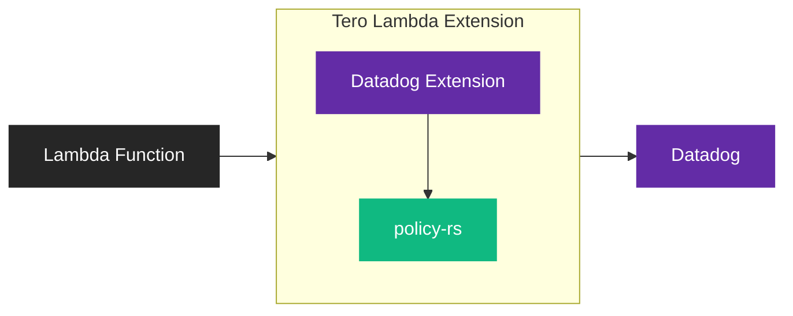

Apply policies to logs, metrics, and traces emitted by your Lambda functions
before they reach Datadog.

<Info>
  Looking to filter AWS service logs (CloudWatch, S3, etc.)? See the [Lambda
  Forwarder](/integrations/datadog-lambda-forwarder) instead.
</Info>

## How it works

The Tero Datadog Lambda Extension is a fork of the
[Datadog Lambda Extension](https://docs.datadoghq.com/serverless/libraries_integrations/extension/)
with policy-based telemetry filtering. It runs as a Lambda layer alongside your
function, evaluating each telemetry item against your policies before forwarding
to Datadog.



<Note>
  The extension does not support FIPS compliance. Reach out to [Tero
  Support](mailto:support@usetero.com) if this is required for your environment.
</Note>

### Versioning

Releases track Datadog's upstream releases. Upstream publishes `v<N>` tags, so a
Tero release named for upstream v119 contains upstream v119. A new Tero release
follows each upstream release.

An AWS layer version is a single integer, and AWS only ever appends to it — you
cannot ask for version 119. So the upstream version goes in the layer **name**,
and the layer **version** integer is the patch number:

| Release | Layer name                   | Layer version |
| ------- | ---------------------------- | ------------- |
| v119    | `Tero-Datadog-Extension-119` | 1             |
| v119.2  | `Tero-Datadog-Extension-119` | 2             |
| v120    | `Tero-Datadog-Extension-120` | 1             |

This keeps the upstream number exact in every region without publishing filler
versions to advance a counter, and it gives patches somewhere to live. A region
we add later starts at patch 1, so patch numbers can differ per region. The
upstream number never does.

The older `Tero-Datadog-Extension` and `Tero-Datadog-Extension-ARM` layers, at
versions 1 through 4, still exist and still work. Move to a versioned name when
you next update the layer.

## Prerequisites

- Lambda function with Datadog monitoring configured (see
  [Datadog's Lambda setup guide](https://docs.datadoghq.com/serverless/installation/))
- Tero account

## Connect

<Steps>
  <Snippet file="create-edge-api-key.mdx" />

  <Step title="Add the Lambda layer">
    Replace the standard Datadog extension layer with the Tero version.

    **ARM64:**
    ```
    arn:aws:lambda:<region>:242046726909:layer:Tero-Datadog-Extension-<dd-version>-ARM:<patch>
    ```

    **AMD64:**
    ```
    arn:aws:lambda:<region>:242046726909:layer:Tero-Datadog-Extension-<dd-version>:<patch>
    ```

    Three parts change. The account ID `242046726909` does not.

    - `<region>` must match your function's region. We publish to `us-east-1`, `us-east-2`, `us-west-1`, `us-west-2`, `eu-west-1`, `eu-west-2`, `eu-west-3`, `eu-central-1`, and `eu-north-1`.
    - `<dd-version>` is the Datadog extension version the layer is built from. Pick the name matching the version you want: `Tero-Datadog-Extension-119` contains Datadog v119.
    - `<patch>` is Tero's patch number for that Datadog version. Use the highest one published for it in your region.

    <Note>
    The [releases](https://github.com/usetero/datadog-lambda-extension/releases) list both numbers. A `v119.2` release is Datadog v119, patch 2. See [Versioning](#versioning) for why the version lives in the name.
    </Note>

  </Step>

  <Step title="Configure environment variables">
    Add these environment variables to your Lambda function:

    ```bash
    DD_POLICY_ENABLED=true
    DD_POLICY_PROVIDERS='[{"id":"tero","type":"http","url":"https://sync.usetero.com/v1/policy/sync","headers":[{"name":"Authorization","value":"Bearer YOUR_TERO_API_KEY"}],"poll_interval_secs":60}]'
    ```

    <Info>
    This assumes `DD_API_KEY` and `DD_EXTENSION_ENABLED=true` are already configured from your existing Datadog setup.
    </Info>

    <Warning>
    Replace `YOUR_TERO_API_KEY` with the API key you created in step 1. The extension will fail to sync policies without a valid bearer token.
    </Warning>

  </Step>

  <Step title="Verify">
    Invoke your Lambda function and check CloudWatch logs for extension startup:

    ```
    [tero] Extension started, policies loaded: 5
    ```

    In Datadog, confirm the expected logs, metrics, or traces arrive and that
    any test telemetry matching your policy is absent or sampled at the expected
    rate.

  </Step>
</Steps>

## Policy providers

The extension fetches policies from configured providers. Set
`DD_POLICY_PROVIDERS` to a JSON array of provider configurations.

### HTTP provider

Recommended for production. Fetches policies from a remote endpoint and polls
for updates.

```bash
DD_POLICY_PROVIDERS='[{"id":"tero","type":"http","url":"https://sync.usetero.com/v1/policy/sync","headers":[{"name":"Authorization","value":"Bearer YOUR_API_KEY"}],"poll_interval_secs":60}]'
```

### File provider

For local testing. Reads policies from a file bundled with your Lambda
deployment.

```bash
DD_POLICY_PROVIDERS='[{"id":"local","type":"file","path":"/var/task/policies.json"}]'
```

### Provider options

| Field                | Type   | Required  | Description                               |
| -------------------- | ------ | --------- | ----------------------------------------- |
| `id`                 | string | Yes       | Unique identifier for this provider       |
| `type`               | string | Yes       | `http` or `file`                          |
| `url`                | string | http only | URL to fetch policies from                |
| `path`               | string | file only | Path to local policy JSON file            |
| `headers`            | array  | No        | HTTP headers for authentication           |
| `poll_interval_secs` | number | No        | Polling interval in seconds (default: 60) |

## Deployment examples

<Tabs>
  <Tab title="Terraform">
    ```hcl
    resource "aws_lambda_function" "example" {
      function_name = "my-function"
      runtime       = "python3.12"
      architectures = ["arm64"]

      layers = [
        "arn:aws:lambda:us-east-1:242046726909:layer:Tero-Datadog-Extension-<dd-version>-ARM:<patch>"
      ]

      environment {
        variables = {
          DD_API_KEY           = var.datadog_api_key
          DD_EXTENSION_ENABLED = "true"
          DD_POLICY_ENABLED    = "true"
          DD_POLICY_PROVIDERS  = jsonencode([
            {
              id   = "tero"
              type = "http"
              url  = "https://sync.usetero.com/v1/policy/sync"
              headers = [
                { name = "Authorization", value = "Bearer ${var.tero_api_key}" }
              ]
              poll_interval_secs = 60
            }
          ])
        }
      }
    }
    ```

  </Tab>
  <Tab title="AWS SAM">
    ```yaml
    MyFunction:
      Type: AWS::Serverless::Function
      Properties:
        Runtime: python3.12
        Architectures:
          - arm64
        Layers:
          - arn:aws:lambda:us-east-1:242046726909:layer:Tero-Datadog-Extension-<dd-version>-ARM:<patch>
        Environment:
          Variables:
            DD_API_KEY: !Ref DatadogApiKey
            DD_EXTENSION_ENABLED: "true"
            DD_POLICY_ENABLED: "true"
            DD_POLICY_PROVIDERS: !Sub |
              [{"id":"tero","type":"http","url":"https://sync.usetero.com/v1/policy/sync","headers":[{"name":"Authorization","value":"Bearer ${TeroApiKey}"}],"poll_interval_secs":60}]
    ```
  </Tab>
  <Tab title="Serverless Framework">
    ```yaml
    functions:
      myFunction:
        runtime: python3.12
        architecture: arm64
        layers:
          - arn:aws:lambda:us-east-1:242046726909:layer:Tero-Datadog-Extension-<dd-version>-ARM:<patch>
        environment:
          DD_API_KEY: ${ssm:/datadog/api-key}
          DD_EXTENSION_ENABLED: "true"
          DD_POLICY_ENABLED: "true"
          DD_POLICY_PROVIDERS: '[{"id":"tero","type":"http","url":"https://sync.usetero.com/v1/policy/sync","headers":[{"name":"Authorization","value":"Bearer ${ssm:/tero/api-key}"}],"poll_interval_secs":60}]'
    ```
  </Tab>
  <Tab title="AWS CLI">
    ```bash
    aws lambda update-function-configuration \
      --function-name my-function \
      --layers "arn:aws:lambda:us-east-1:242046726909:layer:Tero-Datadog-Extension-<dd-version>-ARM:<patch>" \
      --environment "Variables={DD_API_KEY=your-api-key,DD_EXTENSION_ENABLED=true,DD_POLICY_ENABLED=true,DD_POLICY_PROVIDERS='[{\"id\":\"tero\",\"type\":\"http\",\"url\":\"https://sync.usetero.com/v1/policy/sync\",\"headers\":[{\"name\":\"Authorization\",\"value\":\"Bearer your-tero-key\"}]}]'}"
    ```
  </Tab>
</Tabs>

## How policy filtering works

When `DD_POLICY_ENABLED=true`:

1. The extension fetches policies from configured providers on startup
2. HTTP providers poll for updates at the configured interval
3. The extension evaluates each telemetry item (logs, traces, metrics) against
   policies
4. Based on policy rules, the extension keeps, drops, samples, or rate-limits
   each item

If no policy matches an item, the extension keeps it (fail open).

See [Policy Reference](/edge/policy-reference/log-filter) for filtering options.

## Troubleshooting

**Extension not loading**

Verify the layer ARN matches your Lambda architecture (ARM64 vs x86_64) and your
function's region. Check CloudWatch logs for extension startup errors.

**Layer ARN does not resolve**

The layer name carries the Datadog version, so `Tero-Datadog-Extension-118` and
`Tero-Datadog-Extension-119` are different layers. Confirm the version in the
name is one we publish, and that the patch number exists in that region. Patch
numbers can differ per region: a region we added later starts at patch 1, so a
patch that resolves in `us-east-1` may not resolve in `eu-north-1` yet.

**Policies not applying**

- Ensure `DD_POLICY_ENABLED=true` is set
- Verify `DD_POLICY_PROVIDERS` is valid JSON
- Check that your policy provider URL is accessible from the Lambda VPC

**Authentication errors**

- Verify the Authorization header value is correct
- Ensure your Tero API key is valid and not revoked
