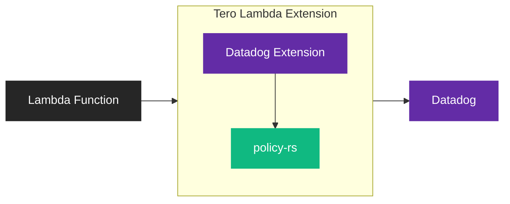

Apply policies to logs, metrics, and traces from AWS Lambda functions before
they reach Datadog.

## How it works

The Tero Datadog Lambda Extension is a fork of the
[Datadog Lambda Extension](https://docs.datadoghq.com/serverless/libraries_integrations/extension/)
with policy-based telemetry filtering. It runs as a Lambda layer alongside your
function, evaluating each telemetry item against your policies before forwarding
to Datadog.



We maintain this fork to release within two weeks of upstream Datadog releases.

<Note>FIPS compliance is not currently supported.</Note>

## Prerequisites

- Lambda function with Datadog monitoring configured (see
  [Datadog's Lambda setup guide](https://docs.datadoghq.com/serverless/installation/))
- Tero account

## Connect

<Steps>
  <Step title="Create an Edge API key">
    Open your terminal and run:

    ```bash
    tero
    ```

    Navigate to **Edge** → **API Keys** → **Create**. Name your key (e.g., "Lambda production"). Copy the key when shown—it's only displayed once.

  </Step>

  <Step title="Add the Lambda layer">
    Replace the standard Datadog extension layer with the Tero version.

    **ARM64:**
    ```
    arn:aws:lambda:us-east-1:242046726909:layer:Datadog-Extension-ARM-Tero:<version>
    ```

    **AMD64:**
    ```
    arn:aws:lambda:us-east-1:242046726909:layer:Datadog-Extension-Tero:<version>
    ```

    <Note>
    Replace `<version>` with the latest version number. Check the [releases](https://github.com/usetero/datadog-lambda-extension) for current versions.
    </Note>

  </Step>

  <Step title="Configure environment variables">
    Add these environment variables to your Lambda function:

    ```bash
    # Required: Your Datadog API key, this should already be present
    DD_API_KEY=your-datadog-api-key

    # Required: Enable the extension, this should already be present
    DD_EXTENSION_ENABLED=true

    # Required: Enable policy filtering
    DD_POLICY_ENABLED=true

    # Required: Configure policy provider
    DD_POLICY_PROVIDERS='[{"id":"tero","type":"http","url":"https://sync.usetero.com/v1/policy/sync","headers":[{"name":"Authorization","value":"Bearer YOUR_TERO_API_KEY"}],"poll_interval_secs":60}]'
    ```

    <Warning>
    Replace `YOUR_TERO_API_KEY` with the API key you created in step 1. The extension will fail to sync policies without a valid bearer token.
    </Warning>

  </Step>

  <Step title="Verify">
    Invoke your Lambda function and check CloudWatch logs for extension startup:

    ```
    [tero] Extension started, policies loaded: 5
    ```

    Confirm telemetry reaches Datadog with policies applied.

  </Step>
</Steps>

## Policy providers

The extension fetches policies from configured providers. Set
`DD_POLICY_PROVIDERS` to a JSON array of provider configurations.

### HTTP provider

Recommended for production. Fetches policies from a remote endpoint and polls
for updates.

```bash
DD_POLICY_PROVIDERS='[{"id":"tero","type":"http","url":"https://sync.usetero.com/v1/policy/sync","headers":[{"name":"Authorization","value":"Bearer YOUR_API_KEY"}],"poll_interval_secs":60}]'
```

### File provider

For local testing. Reads policies from a file bundled with your Lambda
deployment.

```bash
DD_POLICY_PROVIDERS='[{"id":"local","type":"file","path":"/var/task/policies.json"}]'
```

### Provider options

| Field                | Type   | Required  | Description                               |
| -------------------- | ------ | --------- | ----------------------------------------- |
| `id`                 | string | Yes       | Unique identifier for this provider       |
| `type`               | string | Yes       | `http` or `file`                          |
| `url`                | string | http only | URL to fetch policies from                |
| `path`               | string | file only | Path to local policy JSON file            |
| `headers`            | array  | No        | HTTP headers for authentication           |
| `poll_interval_secs` | number | No        | Polling interval in seconds (default: 60) |

## Deployment examples

### Terraform

```hcl
resource "aws_lambda_function" "example" {
  function_name = "my-function"
  runtime       = "python3.12"
  architectures = ["arm64"]

  layers = [
    "arn:aws:lambda:us-east-1:242046726909:layer:Datadog-Extension-ARM-Tero:1"
  ]

  environment {
    variables = {
      DD_API_KEY           = var.datadog_api_key
      DD_EXTENSION_ENABLED = "true"
      DD_POLICY_ENABLED    = "true"
      DD_POLICY_PROVIDERS  = jsonencode([
        {
          id   = "tero"
          type = "http"
          url  = "https://sync.usetero.com/v1/policy/sync"
          headers = [
            { name = "Authorization", value = "Bearer ${var.tero_api_key}" }
          ]
          poll_interval_secs = 60
        }
      ])
    }
  }
}
```

### AWS SAM

```yaml
MyFunction:
  Type: AWS::Serverless::Function
  Properties:
    Runtime: python3.12
    Architectures:
      - arm64
    Layers:
      - arn:aws:lambda:us-east-1:242046726909:layer:Datadog-Extension-ARM-Tero:1
    Environment:
      Variables:
        DD_API_KEY: !Ref DatadogApiKey
        DD_EXTENSION_ENABLED: "true"
        DD_POLICY_ENABLED: "true"
        DD_POLICY_PROVIDERS: !Sub |
          [{"id":"tero","type":"http","url":"https://sync.usetero.com/v1/policy/sync","headers":[{"name":"Authorization","value":"Bearer ${TeroApiKey}"}],"poll_interval_secs":60}]
```

### Serverless Framework

```yaml
functions:
  myFunction:
    runtime: python3.12
    architecture: arm64
    layers:
      - arn:aws:lambda:us-east-1:242046726909:layer:Datadog-Extension-ARM-Tero:1
    environment:
      DD_API_KEY: ${ssm:/datadog/api-key}
      DD_EXTENSION_ENABLED: "true"
      DD_POLICY_ENABLED: "true"
      DD_POLICY_PROVIDERS:
        '[{"id":"tero","type":"http","url":"https://sync.usetero.com/v1/policy/sync","headers":[{"name":"Authorization","value":"Bearer
        ${ssm:/tero/api-key}"}],"poll_interval_secs":60}]'
```

### AWS CLI

```bash
aws lambda update-function-configuration \
  --function-name my-function \
  --layers "arn:aws:lambda:us-east-1:242046726909:layer:Datadog-Extension-ARM-Tero:1" \
  --environment "Variables={DD_API_KEY=your-api-key,DD_EXTENSION_ENABLED=true,DD_POLICY_ENABLED=true,DD_POLICY_PROVIDERS='[{\"id\":\"tero\",\"type\":\"http\",\"url\":\"https://sync.usetero.com/v1/policy/sync\",\"headers\":[{\"name\":\"Authorization\",\"value\":\"Bearer your-tero-key\"}]}]'}"
```

## How policy filtering works

When `DD_POLICY_ENABLED=true`:

1. The extension fetches policies from configured providers on startup
2. HTTP providers poll for updates at the configured interval
3. Each telemetry item (logs, traces, metrics) is evaluated against policies
4. Based on policy rules, items are either kept, dropped, sampled, or rate
   limited

If no policy matches an item, it is kept (fail-open behavior).

See [Policy Reference](/edge/policy-reference/log-filter) for filtering options.

## Troubleshooting

**Extension not loading**

Verify the layer ARN matches your Lambda architecture (ARM64 vs x86_64). Check
CloudWatch logs for extension startup errors.

**Policies not applying**

- Ensure `DD_POLICY_ENABLED=true` is set
- Verify `DD_POLICY_PROVIDERS` is valid JSON
- Check that your policy provider URL is accessible from the Lambda VPC

**Authentication errors**

- Verify the Authorization header value is correct
- Ensure your Tero API key is valid and not revoked
