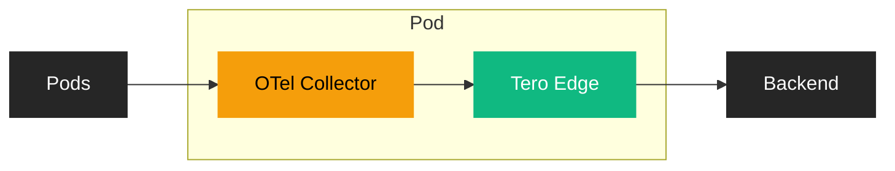

Deploy Tero Edge as a sidecar to your OpenTelemetry Collector to apply policies
to logs, metrics, and traces before they leave your cluster.

## How it works

Edge runs as a sidecar container in the same pod as your OTel Collector. The
collector exports telemetry through Edge via localhost, which applies policies
and forwards to your backend.



## Prerequisites

- OpenTelemetry Collector running on Kubernetes (via
  [Helm](https://opentelemetry.io/docs/kubernetes/helm/collector/) or
  [OpenTelemetry Operator](https://opentelemetry.io/docs/kubernetes/operator/))
- `kubectl` access to your cluster
- Tero account

## Connect

<Steps>
  <Step title="Create an Edge API key">
    Open your terminal and run:

    ```bash
    tero
    ```

    Navigate to **Edge** → **API Keys** → **Create**. Name your key (e.g., "OTel Collector"). Copy the key when shown—it's only displayed once.

  </Step>

  <Step title="Create the secret">
    Store your API key as a Kubernetes secret:

    ```bash
    kubectl create secret generic tero-edge \
      --from-literal=api-key=YOUR_API_KEY
    ```

  </Step>

  <Step title="Create the Edge ConfigMap">
    Create a ConfigMap with your Edge configuration:

    ```yaml tero-edge-config.yaml
    apiVersion: v1
    kind: ConfigMap
    metadata:
      name: tero-edge-config
    data:
      config.json: |
        {
          "listen_address": "127.0.0.1",
          "listen_port": 8080,
          "upstream_url": "https://your-backend-endpoint.com",
          "log_level": "info",
          "max_body_size": 1048576,
          "policy_providers": [
            {
              "id": "tero",
              "type": "http",
              "url": "https://sync.usetero.com/v1/policy/sync",
              "headers": [
                { "name": "Authorization", "value": "Bearer ${TERO_API_KEY}" }
              ],
              "poll_interval_secs": 60
            }
          ]
        }
    ```

    ```bash
    kubectl apply -f tero-edge-config.yaml
    ```

    <Note>
    Set `upstream_url` to your telemetry backend endpoint (e.g., Datadog, Splunk, Grafana Cloud).
    </Note>

  </Step>

  <Step title="Add Edge as a sidecar">
    Add the Edge container to your collector deployment.

    <Tabs>
      <Tab title="OpenTelemetry Operator">
        Add the sidecar to your `OpenTelemetryCollector` CR:

        ```yaml
        apiVersion: opentelemetry.io/v1beta1
        kind: OpenTelemetryCollector
        metadata:
          name: otel-collector
        spec:
          mode: deployment
          config:
            exporters:
              otlphttp:
                endpoint: http://localhost:8080
            service:
              pipelines:
                logs:
                  exporters: [otlphttp]
                metrics:
                  exporters: [otlphttp]
                traces:
                  exporters: [otlphttp]
          volumes:
            - name: tero-edge-config
              configMap:
                name: tero-edge-config
          volumeMounts:
            - name: tero-edge-config
              mountPath: /etc/tero
              readOnly: true
          additionalContainers:
            - name: tero-edge
              image: ghcr.io/usetero/edge:latest
              args:
                - /etc/tero/config.json
              env:
                - name: TERO_API_KEY
                  valueFrom:
                    secretKeyRef:
                      name: tero-edge
                      key: api-key
              resources:
                requests:
                  cpu: 50m
                  memory: 32Mi
                limits:
                  cpu: 200m
                  memory: 64Mi
              volumeMounts:
                - name: tero-edge-config
                  mountPath: /etc/tero
                  readOnly: true
              livenessProbe:
                httpGet:
                  path: /_health
                  port: 8080
                initialDelaySeconds: 5
                periodSeconds: 10
              readinessProbe:
                httpGet:
                  path: /_health
                  port: 8080
                initialDelaySeconds: 2
                periodSeconds: 5
        ```
      </Tab>
      <Tab title="Helm">
        Add to your `values.yaml`:

        ```yaml
        extraVolumes:
          - name: tero-edge-config
            configMap:
              name: tero-edge-config

        extraVolumeMounts:
          - name: tero-edge-config
            mountPath: /etc/tero
            readOnly: true

        extraContainers:
          - name: tero-edge
            image: ghcr.io/usetero/edge:latest
            args:
              - /etc/tero/config.json
            env:
              - name: TERO_API_KEY
                valueFrom:
                  secretKeyRef:
                    name: tero-edge
                    key: api-key
            resources:
              requests:
                cpu: 50m
                memory: 32Mi
              limits:
                cpu: 200m
                memory: 64Mi
            volumeMounts:
              - name: tero-edge-config
                mountPath: /etc/tero
                readOnly: true
            livenessProbe:
              httpGet:
                path: /_health
                port: 8080
              initialDelaySeconds: 5
              periodSeconds: 10
            readinessProbe:
              httpGet:
                path: /_health
                port: 8080
              initialDelaySeconds: 2
              periodSeconds: 5

        config:
          exporters:
            otlphttp:
              endpoint: http://localhost:8080
          service:
            pipelines:
              logs:
                exporters: [otlphttp]
              metrics:
                exporters: [otlphttp]
              traces:
                exporters: [otlphttp]
        ```
      </Tab>
    </Tabs>

    The collector exports to `localhost:8080`, which is the Edge sidecar. Edge applies policies and forwards to your configured upstream.

  </Step>

  <Step title="Verify">
    Check that the collector pod has both containers running:

    ```bash
    kubectl get pods -l app.kubernetes.io/name=otel-collector
    ```

    Check Edge logs for incoming traffic:

    ```bash
    kubectl logs <collector-pod> -c tero-edge --tail=50
    ```

  </Step>
</Steps>

## Policy providers

Edge supports multiple policy sources. Configure them in the `policy_providers`
array in your ConfigMap.

### File provider

Load policies from a local file. Good for static policies bundled in the
ConfigMap.

```json
{
  "id": "file",
  "type": "file",
  "path": "/etc/tero/policies.json"
}
```

### HTTP provider

Fetch policies from a remote endpoint. Good for dynamic policies managed via the
Tero API.

```json
{
  "id": "tero",
  "type": "http",
  "url": "https://sync.usetero.com/v1/policy/sync",
  "headers": [{ "name": "Authorization", "value": "Bearer ${TERO_API_KEY}" }],
  "poll_interval_secs": 60
}
```

The `${TERO_API_KEY}` variable is injected from the Kubernetes secret via the
container environment configuration.

## Troubleshooting

**Collector can't reach Edge**

Verify both containers are running in the same pod:

```bash
kubectl describe pod <collector-pod>
```

Ensure the collector is exporting to `http://localhost:8080`.

**Policies not applying**

Check Edge loaded policies successfully:

```bash
kubectl logs <collector-pod> -c tero-edge | grep -i policy
```

**Traffic not reaching backend**

Verify `upstream_url` in the ConfigMap points to your backend. Check Edge logs
for upstream connection errors.
