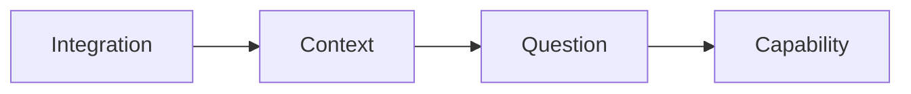

# Voice

How we write. The tone, patterns, and anti-patterns that define Tero's documentation voice.

## The Core Principle

Write like you're explaining something to a smart colleague. Not a presentation, not a performance. Just clear communication between people who both have things to do.

Our reader is a skeptical engineer who's been burned by vendor marketing. They can smell bullshit instantly. Corporate speak, vague claims, over-promising—these trigger immediate dismissal.

But they also respond to craft. When they see something well-designed, they recognize it. The goal is to earn their trust through clarity, honesty, and technical depth.

## Tone

### Conversational, Not Casual

Write like you talk, but edited. No "Hey there!" or forced friendliness. No slang that might not translate. Just direct, human communication.

**Good:** "Tero compresses billions of log lines into thousands of semantic events."

**Bad:** "So basically, what we do is take all those logs and crunch them down into something way more manageable!"

### Confident, Not Arrogant

State what's true and move on. Don't hedge unnecessarily, but don't claim to be the best at everything either.

**Good:** "We can answer this question because we build something no one else has: a semantic understanding of your telemetry."

**Bad:** "We're revolutionizing the observability industry with our groundbreaking AI-powered solution."

### Technical, Not Jargon-Heavy

Use real engineering terms. Mention technologies by name (Hyperscan, OTel, ClickHouse). But explain concepts when they're not obvious, and don't use jargon just to sound smart.

**Good:** "The policy engine uses Hyperscan, a high-performance regex library that can match tens of thousands of patterns at line rate."

**Bad:** "Our proprietary pattern-matching technology leverages cutting-edge algorithms."

### Honest About Limits

Say what Tero doesn't do yet. Be clear about current scope. This builds trust.

**Good:** "Right now, Tero answers questions about data waste. Questions like 'Why is checkout slow?' are coming—the same context graph makes them possible."

**Bad:** "Tero can answer any question about your systems!" (if it can't yet)

## Patterns to Follow

### Lead with the Point

Don't build up to your conclusion. State it, then explain.

**Good:**
> Tero doesn't charge per GB. We don't care how much data you have. Our pricing is based on [whatever it is], not volume.

**Bad:**
> Many observability vendors charge based on data volume. This creates a problematic incentive where... [three paragraphs later]... That's why Tero doesn't charge per GB.

### Use Concrete Examples

Abstract concepts become clear with specifics.

**Good:**
> A `payment_failed` log isn't just a string with fields. It's a business event indicating a transaction didn't complete. The `user_id` field is context that matters for debugging. The `error_code` tells you why it failed.

**Bad:**
> Log events are enriched with semantic meaning that provides additional context for analysis.

### Progressive Disclosure

Start simple. Add depth for those who want it.

**Good:**
> Tero builds a semantic understanding of your telemetry. [Link: How the context graph works]

Then the linked page goes deep on the architecture.

**Bad:**
> Dumping all the technical details on the first page, overwhelming newcomers.

### Active Voice

Say who does what. Passive voice obscures and bores.

**Good:** "Tero analyzes your logs and identifies waste."

**Bad:** "Logs are analyzed and waste is identified."

### Short Paragraphs

Dense walls of text are hard to scan. Keep paragraphs focused—one idea each.

### Vary Sentence Length

Short sentences create emphasis. Longer sentences let you develop complex ideas and show how different pieces connect together. Mix them for rhythm.

## Patterns to Avoid

### Corporate Speak

These phrases mean nothing and signal "we're like everyone else":

- Best-in-class
- Enterprise-grade
- Seamless integration
- Cutting-edge
- Industry-leading
- Synergy, leverage, empower
- World-class

Just say what the thing does.

### AI-Writing Tells

These patterns scream "an LLM wrote this":

- "Delve into"
- "It's worth noting that"
- "In today's world" / "In the modern era"
- "Let's explore"
- Starting paragraphs with "Moreover," "Furthermore," "Additionally"
- Excessive bolding for emphasis
- Lists where prose works better

If you find yourself writing these, rewrite.

### Hedging and Qualifiers

Phrases that undermine confidence:

- "Arguably"
- "Potentially"
- "Relatively"
- "Somewhat"
- "In some cases" (unless being specific)

Either something is true or it isn't. If you're not sure, find out before writing.

### Self-Congratulation

Don't pat yourself on the back:

- "We're proud to offer..."
- "This innovative approach..."
- "Our revolutionary technology..."
- "Not bureaucracy—just thoughtful collaboration" (the defensive self-praise)

If something is innovative or thoughtful, the reader will see it. You don't need to point it out.

### Over-Promising

Don't claim capabilities that don't exist. Don't use future tense for features not yet shipped. Don't say "any question" when you mean specific questions.

The skeptical reader will test your claims. Better to under-promise and over-deliver.

## Formatting

### Headings

Use headings to organize thinking, not to compensate for unclear prose. If you need constant subheadings to make your point, you probably need clearer writing instead.

### Lists

Lists are great for actual lists of things. They're not a crutch to avoid writing connected thoughts. If you're tempted to make a bulleted list, ask whether it would be stronger as regular prose.

### Bold

Bolding should be rare. When you bold something, you're saying "you might miss this if I don't highlight it." That's fine occasionally, but if you're bolding multiple things per paragraph, you're either burying your lead or you don't trust your reader.

### Code

Use inline `code` for:
- CLI commands
- File paths
- Function/method names
- Configuration keys

Use code blocks for:
- Multi-line commands
- Configuration examples
- API requests/responses

### Links

Link generously to related concepts. Don't force readers to hunt for information. But don't over-link—every link is a decision point that might take them away from what they're reading.

### Diagrams

Use diagrams when they clarify better than prose.

**ASCII diagrams** for simple relationships, hierarchies, or anything that should be scannable without rendering:

```
Control Plane ──▶ Edge ──▶ Your Vendor
                   │
                   ▼
              Policies
```

**Mermaid diagrams** for flows, sequences, or anything with direction and complexity. Mintlify renders these natively:



Prefer ASCII for quick inline visuals. Use Mermaid when the diagram needs interactivity or when relationships are complex enough to benefit from proper rendering.

## The Edit Test

After writing something, read it out loud. Does it sound like something a real person would say? Or does it sound like corporate communications or AI trying to sound smart?

If you wouldn't say it out loud, rewrite it.

## Examples

### Good Example

> **What percentage of your data is waste?**
>
> Simple question. Brutally hard to answer.
>
> To answer it honestly, you need complete visibility across every telemetry source and deep comprehension of each piece—the ability to assess value, not just match patterns.
>
> No vendor can do this. Datadog sees bytes. Pipeline tools move data without understanding it. Your team has intuitions but no comprehensive view.
>
> We can answer it. Here's how.

Why it works:
- Leads with the point
- Short, punchy sentences
- Concrete about what others can't do
- Confident but not arrogant
- Sets up the explanation

### Bad Example

> **Understanding Your Data Quality Metrics**
>
> In today's complex observability landscape, it's worth noting that understanding the quality of your telemetry data has become increasingly important. Many organizations struggle with the challenge of determining which data is truly valuable and which might be considered less essential for their operational needs.
>
> Our industry-leading platform leverages cutting-edge AI technology to help you delve into your data quality metrics and gain actionable insights. Through our seamless integration with your existing tools, we can provide a comprehensive analysis of your telemetry data.

Why it fails:
- Buries the point in throat-clearing
- Corporate speak ("industry-leading," "cutting-edge," "seamless")
- AI tells ("it's worth noting," "delve into")
- Vague ("less essential for operational needs")
- Passive and distant

## Voice Checklist

Before publishing any page, check:

- [ ] Does it lead with the point?
- [ ] Would I say this out loud?
- [ ] Are there any corporate speak phrases?
- [ ] Are there any AI-writing tells?
- [ ] Is there unnecessary hedging?
- [ ] Am I being honest about limitations?
- [ ] Are examples concrete and specific?
- [ ] Is the formatting helping or cluttering?
- [ ] Would a skeptical engineer find this credible?
