<Badge color="orange" icon="clock">Variable</Badge> <Badge color="green" icon="rotate-left">Reversible</Badge>

Fix the problem at the source. Tero opens a pull request to remove or modify the instrumentation that's generating waste. Your team reviews and merges.

<Note>
Use this for code-level issues like accidental debug statements, excessive payloads, or logs in hot paths. The application stops generating the waste, so nothing needs filtering downstream.
</Note>

## How it works

Tero analyzes your codebase to find the instrumentation generating the waste. It creates a branch, makes the change, and opens a pull request. Your team reviews the PR like any other code change.

```mermaid
flowchart LR
    Issue["Issue and evidence"] --> Change["Code change"]
    Change --> Branch["Tero branch"]
    Branch --> PR["Pull request"]
    PR --> Review["Team review"]
    Review --> Deploy["Merge and deploy"]
    Deploy --> Impact["Waste stops at source"]

    style Issue fill:#0e2b22,stroke:#0e2b22,color:#fafafa
    style Change fill:#00855c,stroke:#006b49,color:#fafafa
    style Branch fill:#262626,stroke:#262626,color:#fafafa
    style PR fill:#262626,stroke:#262626,color:#fafafa
    style Review fill:#262626,stroke:#262626,color:#fafafa
    style Deploy fill:#262626,stroke:#262626,color:#fafafa
    style Impact fill:#d1fae5,stroke:#10b981,color:#065f46
```



## Setup

Connect your source control:

<CardGroup cols={2}>
  <Card title="GitHub" icon="github">
    Install the Tero GitHub App to enable pull requests.
  </Card>
</CardGroup>

## Example

Tero identifies a debug log statement in `checkout-api` that shipped to production. The log says `"got here lol"` and fires 50,000 times per day.

You approve the policy and select "Open PRs." Tero locates the log statement in your codebase:

```python
# src/checkout/service.py, line 142
def process_order(order):
    logger.debug("got here lol")  # <-- Tero removes this line
    ...
```

Tero opens a pull request:

```
Title: Remove debug log from checkout-api

This debug statement shipped to production and generates 50,000 logs/day.
It doesn't appear in any dashboard or alert.

Identified by Tero: https://app.tero.dev/policies/abc123
```

Your team reviews the PR. Once they merge and deploy, the application stops generating those logs.

## When to use

Open PRs works best when:

- The waste is a code mistake (debug logs, forgotten print statements)
- The fix is straightforward (remove a line, change a log level)
- You want a permanent fix

For configuration-based issues (debug mode left on), Tero can also open PRs to change config files if they're in version control.
