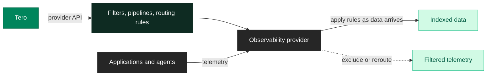

<Badge color="green" icon="bolt">Provider API</Badge> <Badge color="green" icon="rotate-left">Reversible</Badge>

Configure exclusion filters and routing rules directly in your observability provider. Tero uses the provider's API to apply changes, so this path does not require an Edge deployment.

<Note>
Use this when you don't have [Edge](/edge) deployed or want to configure provider-specific features like index routing.
</Note>

## How it works

Tero connects to your provider's API and configures filters, pipelines, or routing rules. The provider applies these rules as data arrives. You don't deploy anything. Tero manages the configuration through the provider API.



For Datadog, Tero configures [exclusion filters](https://docs.datadoghq.com/logs/log_configuration/indexes/#exclusion-filters) and [pipelines](https://docs.datadoghq.com/logs/log_configuration/pipelines/) via the Datadog API.

## Setup

Connect Datadog with write access:

<CardGroup cols={1}>
  <Card title="Datadog" icon="dog" href="/integrations/datadog">
    Connect with Standard role or a custom role with write permissions.
  </Card>
</CardGroup>

## Example

Tero identifies that `checkout-api` is emitting 2.3 million health check logs per day. Query history shows no recent searches for those logs, and they don't appear in any dashboard or alert.

You approve the policy and select "Enforce in provider." Tero configures an exclusion filter in Datadog:

```
Filter name: tero-drop-health-checks-checkout-api
Query: service:checkout-api http.target:/health* http.status_code:200
```

Datadog applies the filter and stops indexing matching logs. You still see them in Live Tail (they reach Datadog), but they don't count against your indexed volume.

Your data quality dashboard updates as Datadog reports the change. If something goes wrong, disable the policy and Tero removes the exclusion filter. Logs index again.

## When to use

Enforce in provider works best when:

- You don't have Edge deployed and want savings now
- You need provider-specific features like index routing
- Egress costs aren't a concern
- You want provider-side controls without deploying infrastructure

If you need maximum control, egress savings, or sub-millisecond latency, use [Enforce at edge](/policies/enforcement/edge) instead.
