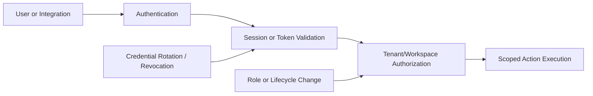

import { securityEmail } from '/snippets/variables.mdx';

<Badge>Last reviewed: March 5, 2026</Badge>
<Badge>Owner: Security + Engineering</Badge>
<Badge>Review cadence: Quarterly</Badge>
<Badge color="green">Status: Implemented</Badge>

This page explains how users and integrations authenticate, how Tero scopes access, and how Tero protects, rotates, and revokes credentials.

## Reviewer focus

- Which identity types are used for users and integrations
- How least-privilege authorization is enforced
- How credentials are stored, rotated, and revoked

## Implementation status (March 5, 2026)

Tero supports SSO and OIDC-capable authentication with tenant and workspace scoped authorization. Tero scopes integration credentials to required operations and supports rotation and revocation.

## Authentication and token flow

## Authentication model

| Access path | Model |
|-------------|-------|
| User access | SSO and OIDC-capable authentication with session controls |
| API integrations | Scoped token-based authentication |
| Administrative actions | Restricted administrative access model |

## Authorization and least privilege

| Control | Implementation |
|---------|----------------|
| Tenant isolation | Tero evaluates requests in tenant and workspace context |
| Role-based access | Tero constrains access by role and permitted operations |
| Scope constraints | Tero limits integration credentials to required functions |
| Access lifecycle | Admins provision access for approved need and remove it when no longer needed |

## Credential lifecycle controls

| Area | Practice |
|------|----------|
| Creation | Issued through controlled integration and admin workflows |
| Storage | Tero stores credentials in managed secret systems |
| Rotation | Supported on demand and through operational workflows |
| Revocation | Immediate disable and revocation supported |
| Source control hygiene | Secrets are not committed to source code |

## Hosted vs self-hosted boundary

| Area | Tero-hosted | Self-hosted |
|------|-------------|-------------|
| Runtime identity controls | Tero-operated | Customer-operated runtime |
| IdP policy and lifecycle rules | Customer-controlled | Customer-controlled |
| Secret backend ownership | Tero-managed services | Customer-managed services |

## Evidence you can request

| Topic | Primary evidence |
|-------|------------------|
| Authentication and password baseline | [Authentication and Password Standard](/trust/policies/authentication-password-standard) |
| Ownership split | [Shared Responsibility](/trust/shared-responsibility) |
| Secret handling and key model | [Encryption and Key Management](/trust/controls/encryption-key-management) |
| Architecture boundaries | [Security Architecture](/trust/architecture) |

## Exceptions and governance

Any identity or access exception requires documented approval, scoped compensating controls, and a target remediation date.

Evidence requests: [{securityEmail}](mailto:{securityEmail})
