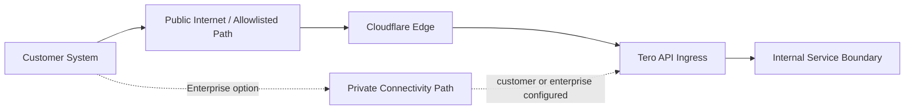

import { securityEmail } from '/snippets/variables.mdx';

<Badge>Last reviewed: March 5, 2026</Badge>
<Badge>Owner: Security + Engineering</Badge>
<Badge>Review cadence: Quarterly</Badge>
<Badge color="green">Status: Implemented</Badge>

This page describes the network baseline for integrations, including TLS, edge protections, and deployment-dependent connectivity options.

## What this page answers

- How traffic reaches Tero and where TLS is terminated
- Which WAF and DDoS controls protect hosted endpoints
- What network restriction options are supported for enterprise deployments

## Current state (as of March 5, 2026)

Hosted APIs are exposed through controlled public endpoints behind Cloudflare edge protections. Self-hosted deployments are customer-controlled for perimeter and routing policy.

## Network path diagram

## Connectivity baseline

| Topic | Tero-hosted | Self-hosted |
|-------|-------------|-------------|
| Integration directionality | Customer-initiated outbound API calls | Customer-defined |
| Inbound into customer environment | Not required for baseline integration | Customer-defined |
| Private connectivity model | Available based on enterprise requirements | Customer-managed |
| Destination restrictions | Allowlisting support for enterprise integrations | Customer-managed |

## Edge protection model (hosted)

| Control area | Implementation |
|--------------|----------------|
| WAF and L7 protections | Cloudflare-managed WAF rules and request controls |
| DDoS protection | Cloudflare network and application-layer DDoS protections |
| Monitoring | Edge and application telemetry monitored for anomalous traffic patterns |
| Rule and change management | Rule changes follow controlled change workflows and validation before production rollout |

## Traffic and termination model

| Path | Tero-hosted | Self-hosted |
|------|-------------|-------------|
| External API traffic | HTTPS to Tero-managed endpoints | Customer-defined ingress path |
| TLS termination | Hosted edge reverse-proxy layer | Customer-defined termination model |
| Service-to-service traffic | Managed cloud network segmentation and service boundaries | Customer networking controls |

## Evidence you can request

| Topic | Primary evidence |
|-------|------------------|
| Architecture boundary | [Security Architecture](/trust/architecture) |
| Ownership split | [Shared Responsibility](/trust/shared-responsibility) |
| Encryption details | [Encryption and Key Management](/trust/controls/encryption-key-management) |

## Exceptions and governance

Any network-control exception requires documented risk, compensating controls, and a target remediation date.

Evidence requests: [{securityEmail}](mailto:{securityEmail})
